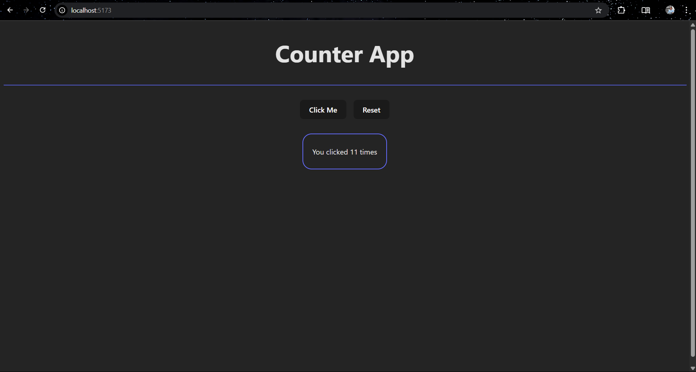

# 🔢 Click Counter App

A simple React app that demonstrates the use of `useState` and event handling. Each click on the button increases the counter by one.

## 📸 Screenshot

 

---

## 🚀 Features

- Functional React component
- State management using `useState`
- Button click event handling
- Minimal inline styling

---

