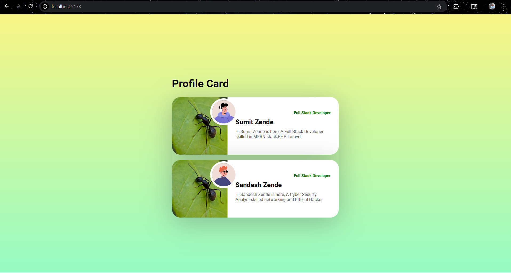

# 👤 User Profile Card - React Mini Project

A stylish and reusable **User Profile Card** component built with **React**. This project demonstrates key beginner React concepts such as **functional components**, **props**, **JSX**, and **basic styling** using custom CSS.

---

## 🚀 Features

- Displays user's avatar, name, title, and short bio.
- Clean, modern card UI design.
- Built using functional components and PropTypes validation.
- Uses CSS Flexbox and gradients for layout and visual appeal.
- Interactive action buttons with hover effects.

---

## 📁 Project Structure

📦 user-profile-card
├── public/
├── src/
│ ├── App.jsx
│ ├── UserCard.jsx
│ ├── UserCard.css
│ └── index.js
├── package.json
└── README.md

yaml
Copy
Edit

---
## 🧪 Technologies Used

- React (Vite)
- JSX
- CSS
- PropTypes
- Google Fonts

## 📸 Screenshot

 

---

## 🧠 Learnings
- This mini-project reinforces:
  - Component reuse
  - Props passing and validation
  - Functional component structure
  - Styling React apps with custom CSS
  - Combining HTML/CSS/JS in a React environment